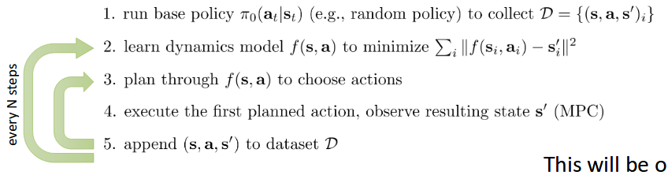

Model Based RL - Imitating Optimal Controllers
================================

## How To Use


**Dependencies**

-TensorFlow   
-MuJoCo version 1.31 /1.51  
-OpenAI Gym  
-Microsoft Visual C++ 

 **Usage**

```
python main.py -n 1 -ep 1000 -m 10 -sp 500 -r 150 -d 2 -b 1000 -m 10
```

**[Detailed Instructions](http://rail.eecs.berkeley.edu/deeprlcourse-fa17/f17docs/hw4.pdf)**

The Model Based RL Framework used in the experiments is shown in the figure below:


# Introduction:

Unlike model-free algorithms(e.g DQN, Policy Gradients, DDPG), model-based RL algorithms tries to learn/understand the dynamics that governs the system/environment. It means these algorithms tries to calculate the transition dynamics of the system to plan and control. Model-free algorithms ignores the dynamics of the world, and tries to approximate the dynamics by repeatedly sampling from the environment, which is why they are not very sample efficient. Model-based RL on the other hand requires less no'of samples and hence used in most of the real-time systems where sampling would be costly/ time consuming. 

Here is a simple algorithm which calculates the model and uses it for optimal control



It uses DAgger procedure to address that data distribution mismatch problem. In step-3, once the dynamics model is fit, we can use any trajectory optimization algorithm(for e.g iLQR(Iterative Linear Quadratic Regulator)) to optimize the trajectory and select the actions at every time step. If the environment is schochastic, It's better to take only the first action and wait for the system to get into the next state rather than taking all actions one after the other. This method is called the Model Predictive Control(MPC). It helps us in replanning at every time-step. If we use MPC, we can use shorter horizons while optimizing the trajectory. The more we replan, the less perfect each individual needs to be. We can also randomly sample an action in the third step of the algorithm(which is not a better way though).


## Experiment 1: Fit a dynamics model to random data alone and use the learned dynamics model in a MPC controller to control the cheetah robot 

An average return of 134 was obtained. Detailed result is shown below:
 
 

Settings Used:
```
python main.py -n 1 -ep 1000 -m 10 -sp 500 -r 150 -d 2 -b 1000 -m 10
```

## Experiment 2: Fit a dynamics model with Data Aggregation and use the learned dynamics model in a MPC controller to control the cheetah robot (3 iterations)

The experiment was run over 3 Dagger iterations because of time constraints with the setting as shown below:

```
python main.py -n 3 -ep 300 -m 10 -sp 500 -r 50 -d 10 -b 2000
```
The rewards Vs Dagger Iteration curve is shown below:


Better results can be obtained with the settings below**(slower)**:

```
python main.py -n 10 -ep 1000 -m 10 -sp 1000 -r 50 -d 10 -b 2000
```

## REFERENCES

1. Nagabandi et all, 2017 ["Neural Network Dynamics
for Model-Based Deep Reinforcement Learning
with Model-Free Fine-Tuning"](https://arxiv.org/pdf/1708.02596.pdf)
2. CS 294: Deep Reinforcement Learning, Fall 2017
